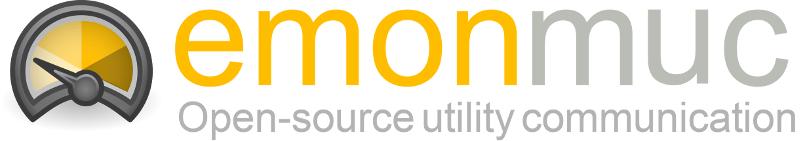

EmonMUC (**e**nergy **mon**itoring **m**ulty **u**tility **c**ommunication) is an *unofficial fork* of the open-source project [OpenMUC](https://www.openmuc.org/), a software framework based on Java and OSGi, that simplifies the development of customized *monitoring, logging and control* systems. It can be used as a basis to flexibly implement anything from simple data loggers to complex SCADA systems. The OpenMUC framework is getting developed at [Fraunhofer ISE](https://ise.fraunhofer.de/) and used as a basis in various smart grid projects. Among other tasks it is used in energy management gateways to readout smart meters, control CHP units, monitor PV systems and control electric vehicle charging. Therefore the OpenMUC framework includes mostly communication protocol drivers from the energy domain.

This project focuses on the easy setup and configuration of hardware such as household metering devices and the visualisation of collected data. All configurations of *OpenMUC* metering devices and further handling of monitored data is therefore managed by [emoncms](https://emoncms.org/), an open-source web application for processing, logging and visualising energy, temperature and other environmental data. Utilizing emoncms possibility to add standalone extensions, a designated PHP module is part of this project, to configure the device communication within the emoncms web views and to incorporate as much helpful tooltips, descriptions and templates as possible, to allow an easy configuration of metering devices.

----------

# Features

This project is developed as an extension to [emoncms](https://emoncms.org/) and adds additional features to the versatile web application. In summary, those are the following highlights:

- **Easy application development:** OpenMUC offers an abstract service for accessing data. Developers can focus on the applications logic rather than the details of the communication and data logging technology.

- **Modularity:** Drivers, data loggers etc. are all individual components. By selecting only the components you need you can create a very light weight system.

- **Drivers:** Out of the box support for several popular communication protocols

    - CSV
    - DLMS/COSEM
    - eHz
    - IEC 60870-5-104
    - IEC 61850
    - IEC 62056-21
    - [HomeMatic (CC1101)](https://github.com/isc-konstanz/OpenHomeMatic)
    - KNX
    - M-Bus (Wired and wireless)
    - Modbus (RTU and TCP/IP)
    - [P-CHARGE](https://github.com/isc-konstanz/OpenPCharge)
    - 1-Wire (Raspberry Pi)
    - GPIO (Raspberry Pi)
    - SNMP
    - [SolarEdge API](https://github.com/isc-konstanz/OpenSolarEdge)

- **Embedded systems:** The framework is designed to run on low-power embedded devices. It is currently being used on embedded x86 and ARM systems. Because OpenMUC is based on Java and OSGi it is platform independent.

----------

# Installation

These setup instructions were documented for Debian Linux based platforms, specifically *Raspbian Stretch*, but may work for other Linux systems without many adjustments. Further guides may follow in the future.

First, the framework can be downloaded either via git or simply copied into a directory like `/opt/emonmuc`.  
Git is a source code management and revision control system, but here it is used to download and update the emonmuc application. After downloading, the right permissions need to be set:

~~~
sudo git clone -b stable https://github.com/isc-konstanz/emonmuc.git /opt/emonmuc
sudo chown pi -R /opt/emonmuc
~~~

The installation process will expect an existing emoncms webserver to be located at `/var/www/html` and will attempt to install it, if the directory *emoncms* cannot be found.  
If the webserver already got installed, the setup may be finished by passing the servers **document root directory** and a registered users **apikey**. Both parameters are optional and the first existing user will be used to register a controller, if none was specified.

~~~
sudo bash /opt/emonmuc/setup.sh --dir /var/www --apikey <apikey>
~~~

A more detailed installation guide, containing separate steps executed in the setup script, can be found here:

- [Ubuntu / Debian Linux via git](doc/LinuxInstall.md)

----------

# Guides

With the system being prepared, some first steps can be taken to learn about the features of emonmuc.  
For this purpose, a [First Steps guide](doc/FirstSteps.md) was documented to be followed.

----------

# Contact

To get in contact with the developers of the OpenMUC project, visit their homepage at [openmuc.org](https://www.openmuc.org/).  
This fork is maintained by:

- **[ISC Konstanz](http://isc-konstanz.de/)** (International Solar Energy Research Center)
- **Adrian Minde**: adrian.minde@isc-konstanz.de
