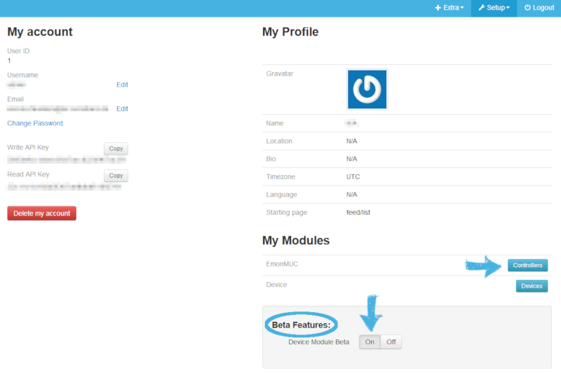
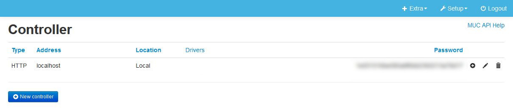
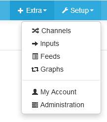
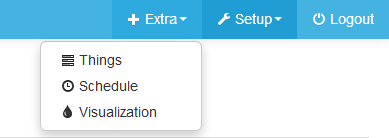
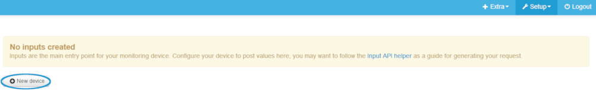
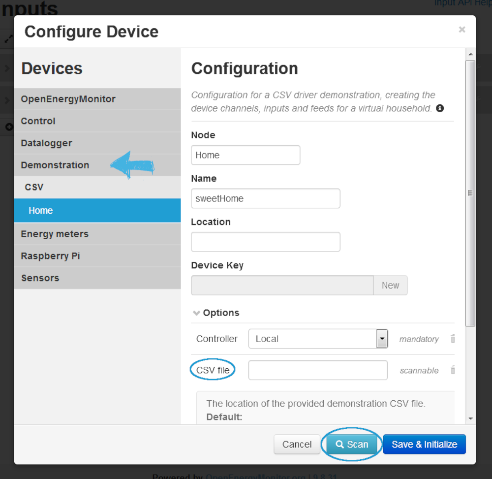
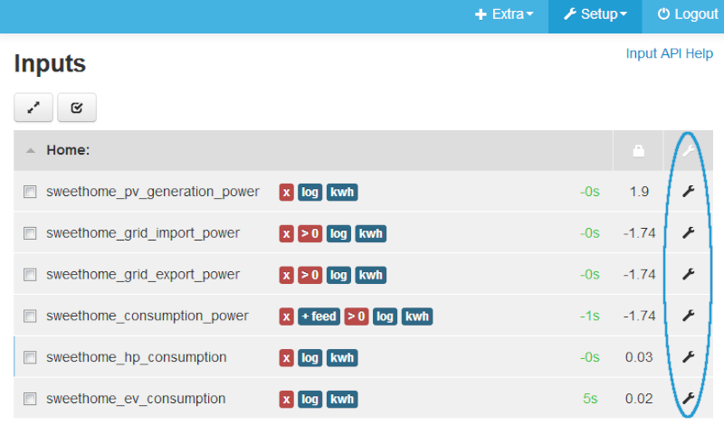
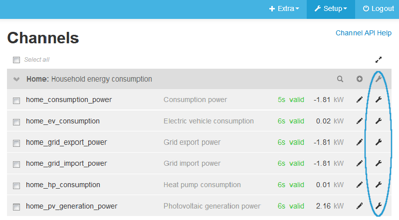
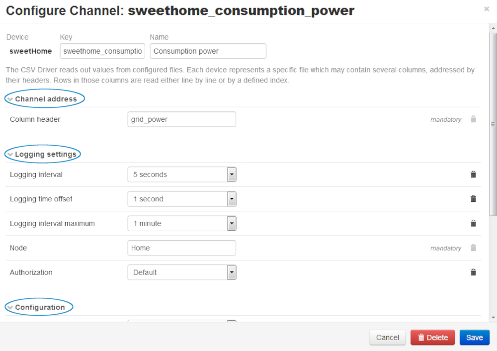
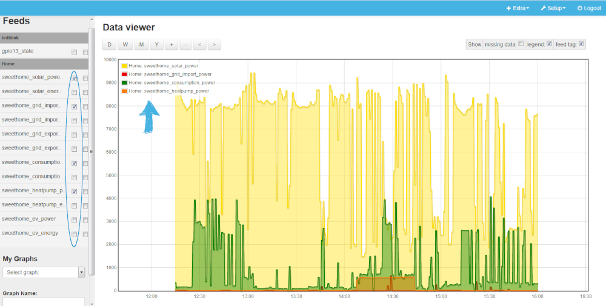

This document describes the first steps with emonmuc (**E**nergy **mon**itoring **M**ulty **U**tility **C**ommunication controller), an open-source protocoll driver project to enable the communication with a variety of metering or other devices, developed based on the [OpenMUC](https://www.openmuc.org/) project.

---------------

# 1 Setup

With both components installed and running, an OpenMUC framework controller was automatically registered to the emoncms user. This can be verified in the **Controllers** page, accessible at the users **My Account** from the menu. 

Click *Multiy Utility Communication* **Configure** and verify the default settings, if the framework is running on the same machine.  

 Now, with the controller registration verified, the automatic registration and initiation can be disabled by modifying `/var/www/emoncms/settings.php`

- Stop controller registration test
   >     $muc_test = false;

To get a first orientation in the framework emoncms, here is a quick overview regarding the structure of emoncms. There are several options located behind the Setup and the Extra button.

**Setup**

*Channels:*

*Inputs:* All Inputs are generated from the Channels. You have the ability to e.g.configure a device or add a new process (e.g. convert W in kWh, Log to feed (is done automatically)). When adding a process there is a detailed explanation for every process and several decisions to make: What kind of process do you want to add? Which engine do you choose? Select the measured interval. All data previously measured in Inputs has not yet been saved. Therefore we have to put them into Feeds. Feed data is then logged persistently to disk. A good explanation on how the logging from Inputs to Feeds works, is given by [OpenEnergyMonitor](https://guide.openenergymonitor.org/setup/local/). When scrolling down to the very bottom of the site, there is a video guide on logging Inputs to Feeds. 

*Feeds:* Submits the graphical output and storage of the information generated in Inputs. It shows the values measured in your devices and the last time measured. Feeds leads to the Graph by either double clicking on the feed you want to visualize or to do a single-click on the feed and than on the Eye-Button.

*Graph:* Graphical output and visualization of the measured data. There is the opportunity to select several feeds. Furthermore two Y-Axes exist to differ between Energy and Power. You can select the color of the graph and fill or stack it to make the graphical output more comprehensive. But be aware that there is no data visible immediately. Wait a few hours to built up some data before trying to view a feed.

*My Account:* Here you get information about your Profile. You can see the User ID, username, Email and your [API Keys](https://cloud.google.com/endpoints/docs/openapi/when-why-api-key) (for Write and Read).

*Administration:* See and edit users, update database (Run this after updating emoncms, after installing a new module or to check emoncms database status), Logger, Server-, and Client Information. 

**Extra**

*Things:* Direct control of the device e.g. switching the LED/plug on and off

*Schedule:* Add time conditions to processes

*Visualization:* Visualization of more specific graphs (e.g. different colors, bar charts). Possibility to embed them into your website. 

All the information might be confusing. Thats the reason we made some tutorials, to get used to emoncms with its different features. 

# 2 Running a test measurement with the CSV driver 

To add a new device (in this instance the CSV-Driver) first go to **Setup --> Inputs** and hit the "New device" button.

##Configure Device
Next step is to configure your device. Therefore go to **Demonstration --> CSV --> Home**. Type in a Node and Name as you like. **But be careful:** There are no blanks allowed for neither Node nor Name! 

Another thing you mandatorily have to fill out is the CSV file. There are two ways of choosing the file: First possibility is to simply type it in. Second possibility is to do a scan and let the programme search for the file. In this tutorial it might be helpful, to use the scan-option given in the configuration menu because you might not know the location of the file.

When clicking scan you might get to choose between two nearly equal devices. Click at one of them to add. After that click **Save** and **Initialize**  

##Inputs
The **Input**-file is now full of information concerning the newly created device. You can see all the Inputs the driver delivers. A few processes are automatically added. Some examples: The **X** stands for the mathematical operator multiply. In our case every value is multiplied with 1000, to get all values from kilo Watt to Watt. Why? Because the process **Power to kWh** needs the Si-Unit Watt to cooperate.

*Note: The unit data comes in, depends on your driver.*

On the right side of the screen you can see a spanner to delete or edit the process or to add a new one. There are detailed explanations on every process you can add. 

##Channels
In **Channels** (as said in the beginning) you can edit the Channel address, the Logging settings, (like Logging Interval -Time difference until this channel is logged again-, the Logging time offset, the Logging interval
 maximum -Dynamically log records only on changed values, up until to a maximum amount of time-), the Configuration and have the possibility to add an option. 
 

##Feeds
In Feeds you can select the Data you want to see in the Graph. You might notice that there are more groups then in Channels and Inputs, more precisely: Exact twice as much. Where does that come from?

It is caused to the fact of having done the process "Power to kWh" earlier in Inputs. Now every measurement is listed in Power (Watt) **and** Energy (kWh).

There are two different ways of getting to the graphical interface: Either by double-clicking on the feed you'd like to visualize or, if you want to e.g. compare different graphs, to do a single click on the feeds you'd like to see and than hit the Eye-button.

##Graph
You can select the scaling for the different processes by clicking either the left or the right square. We decided to just indicate the four most interesting data. There is the opportunity to color every graph or to fill it.

After running the programme for several hours, the graph should look something like this: 

Congratulations! You have done your first test measurement. Now you are able to add a new device, log the Inputs to Feeds and evaluate the graphical output! 

The [next guide](connectingLED.md) is a bit more practical: Its about the connecting and controlling of a LED via GPIO pins.

