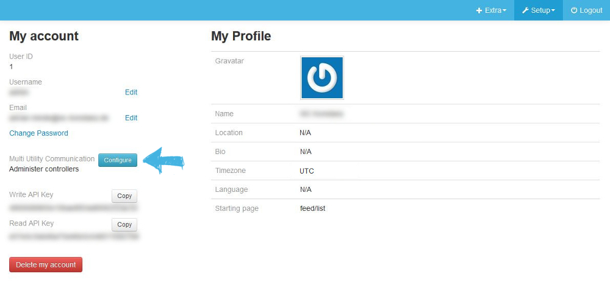

This document describes the first steps with emonmuc (**E**nergy **mon**itoring **M**ulty **U**tility **C**ommunication controller), an open-source protocoll driver project to enable the communication with a variety of metering or other devices, developed based on the [OpenMUC](https://www.openmuc.org/) project.

---------------

# 1 Setup

With both components installed and running, an OpenMUC framework controller was automatically registered to the emoncms user. This can be verified in the **Controllers** page, accessible at the users **My Account** from the menu. 

Click *Multiy Utility Communication* **Configure** and verify the default settings, if the framework is running on the same machine.  

 Now, with the controller registration verified, the automatic registration and initiation can be disabled by modifying `/var/www/emoncms/settings.php`

- Stop controller registration test
   >     $muc_test = false;

# 2 Coming soon

*This section is a placeholder and will be filled with guides and tutorials on how to use this framework in the near future.*

