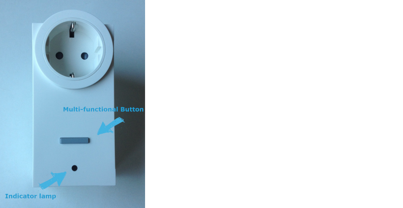
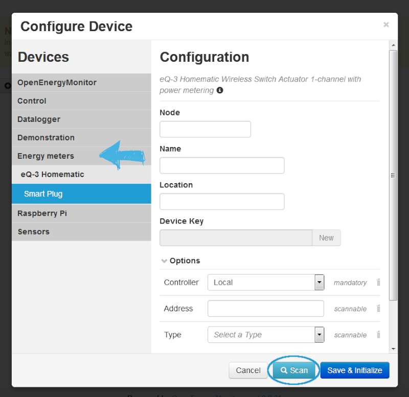
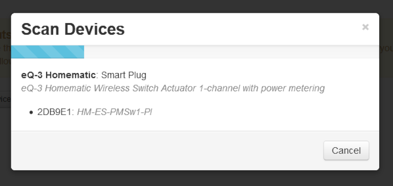
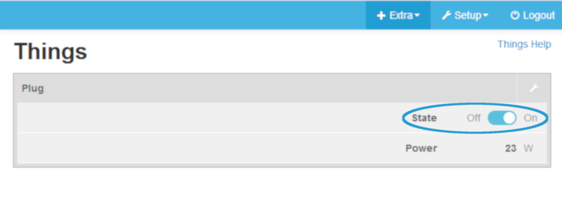

# Connecting and using a Smart Plug

An often used device in a smart home is a Smart Plug. It allows switching of connected loads and measuring voltage, current, active power, frequency and power consumption. This guide will give you a step-by-step guidance how to connect, install and use the plug. The plug we use is a Wireless Switch Actuator 1-channel with power metering from HomeMatic. We recommend for this tutorial that you use the same because the plugs might differ from producer to producer.

The smart plug has got a button, with which you e.g. can turn it on/off, do the teaching-in, depending on how long you press the button. But we will come back to that later. Below the button there is a LED. The intensity and the color of the LED contains Information on the current Setup. For this tutorial only two flashing sequences are interesting: 

**First slow than fast flashing:** Teach-in mode active

**1 s lightning up green:** Teach-in procedure successful

**2 s lightning up green:** Teach-in procedure failed

First step is to put the smart plug into a plug which is connected to the electricity. Before being able to use and configure your device, the switch actuator has to be taught-in first.

**Note: Please read the entire section before starting the teach-in procedure!**

##Teaching-in

You have to teach-in the switch actuator first before using it in Emoncms. When having plugged in the smart plug into the other plug you have to press the button shortly once to turn the plug on. During teach-in, please make sure you maintain a distance of at least 50cm between the HomeMatic devices and the Central Control Unit (your PC with Emoncms running).

To teach-in your device to Emoncms proceed as follows: Open and log into Emoncms. Go to Setup --> Inputs and add a new Device. Configure your Device: Energy meters --> eQ-3 HomeMatic --> Smart Plug. Enter Name and Node as known and hit the “Scan” button. Thats how you start the teach-in procedure. 
 

 
From now on you have 60 seconds to go to your device and press the button. Hold the button for at least four seconds. The LED should start flashing slowly (one time per second) in orange. That means, that the teach-in procedure is in progress. When coming back to your computer, it should show something like this: 
 

 
Click on the device found, save and initialize it. Now you have added and taught-in your smart plug. You can proceed the same way with several other smart plug. 

##Controlling

To control the plug head to Things and turn the plug on/off as you like. In Things you can see the power of the plug, in our case 23W. 

In Channels and Inputs you can see all the parameters the plug can measure with unit, last time measured and value of the measurement: 

Bild von Channels und /oder Inputs
