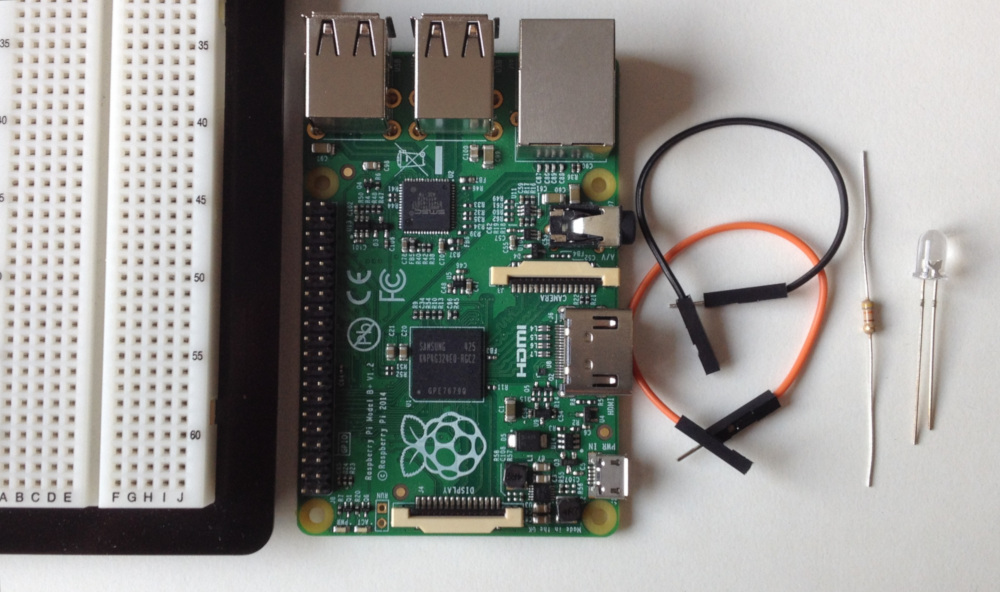
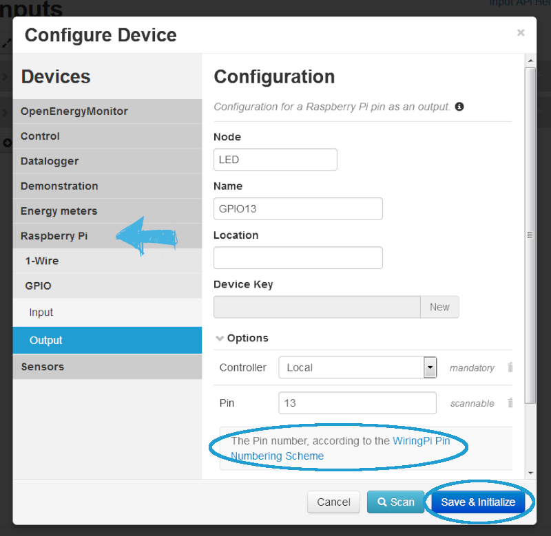
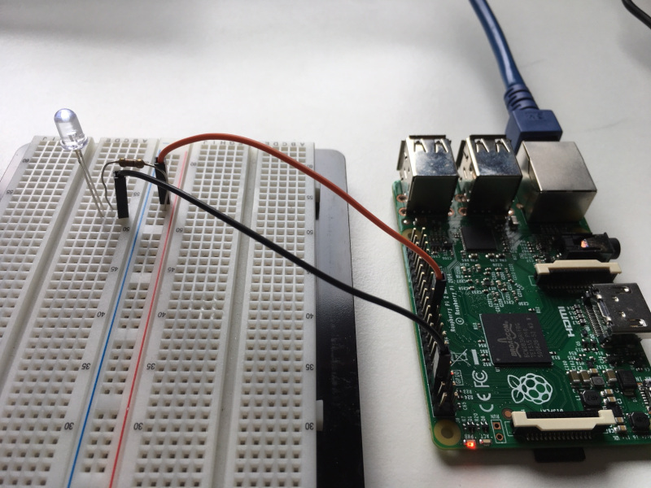
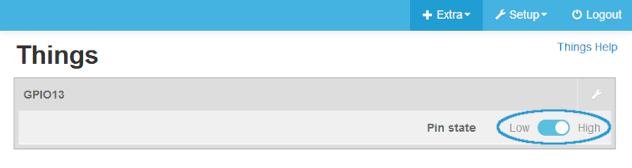

# Connecting and controlling a LED via GPIO

Now, that you are used to the basic dealing with emoncms, lets dig a bit deeper: Next step is to connect and control a LED via GPIO pins: what you need is a Raspberry Pi, a breadboard, some wires (Female-Male), a LED and a resistance (min. 420 Ohm, we used 430 Ohm). If you are not sure, how high your resistance is, go check out [this page](http://www.dieelektronikerseite.de/Tools/Widerstandsrechner.htm) to calculate it. 

First step is to add a new device (in this instance the LED connected to the RasPi). When you can't remember how to do that head back to the [first guide](https://github.com/isc-konstanz/emonmuc/blob/doc/doc/FirstSteps.md).
 
Next step is to configure your device. Therefore go to Raspberry Pi --> GPIO --> Output (because we want the LED to blink, to be the Output) Type in a Node and Name as you like. But be careful: There are no blanks allowed for neither Node nor Name! 

As we know there are the two ways of choosing the pin. In this case it is more convenient to simply type in the pin number.

Important: Pins are sorted according to the [WiringPi Pin Numbering Scheme](http://pi4j.com/pin-numbering-scheme.html) This might be different to the numbering you know from former RasPi projects!

Note: The pin 13 was randomly chosen. Any GPIO-Pin is programmable.

If done, click Save and Initialize and after that Initialize. 

Next up you should prepare your Raspberry and the breadboard. Therefore connect one wire (in our example the black one) from the ground-pin to the breadboard. Connect the resistance and the LED with the board. Last step is to link the (orange) wire with the right pin, in our case it is pin number 21, GPIO number 13. 

Now the fun part, if everything was linked correctly, if not, the sober part.
Navigate to the menu item Things, which can be found under Extra. What you should see now is the following: 

The circled switch is the button of Truth! You simply can turn the LED on and off by pushing the button. Did you do everything correct? Congratulations!

In the Graph file, you can see the activities concerning the LED: 1 LED high, 0 LED low. In the last Tutorial we had a few more, different values, but sometimes simple is beautiful. 

The [next guide](SmartPlug.md) is about the connecting and controlling of a Smart Plug.
